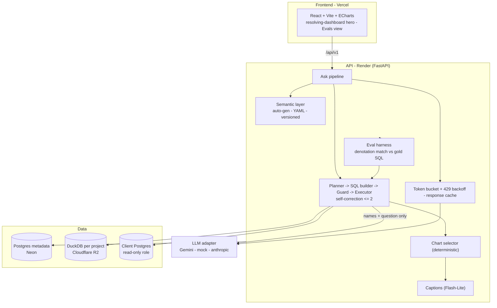

<h1 align="center">InsightIQ</h1>
<p align="center"><em>Ask your data a question in plain English — get a whole interactive dashboard.</em></p>

<p align="center">
  
  
  
  
  
  
</p>

---

## The problem

Text-to-SQL demos return *one* query for *one* chart and fall apart on real
schemas: they hallucinate columns, ignore joins, and have no idea whether the
answer is right. InsightIQ is the productionised version. From a single English
question it builds an editable **semantic layer**, **plans multiple typed
queries**, executes them behind a **hard safety boundary**, picks the **right
chart per result**, lays them out as an **interactive dashboard**, and proves its accuracy with a versioned **eval suite** that runs in CI.

## What it does

1. **Connect or try sample data.** Upload CSV/Excel, connect a read-only Postgres,
   or use the two zero-setup sample projects (synthetic e-commerce + SaaS).
2. **Auto-build a semantic layer.** Profiling infers entities, measures,
   dimensions, joins, and a primary event date -- editable as YAML, versioned.
3. **Ask.** One question -> up to 6 typed intents (trend / breakdown / comparison /
   kpi / distribution) via structured output, each compiled to dialect SQL
   **only from semantic definitions + declared joins**.
4. **Execute safely.** Every statement passes a sqlglot guard (SELECT-only,
   table allowlist, keyword denylist, auto-LIMIT, timeout) before it touches data.
5. **See a dashboard.** Deterministic chart selection, a global date filter that
   re-runs the pipeline, per-card insight captions, and a "View SQL" drawer.
6. **Trust it.** The eval suite scores execution accuracy against hand-written
   gold queries -- and is designed to genuinely fail.

## Architecture



Full DDL, API contract, and semantic-layer schema in [`docs/DESIGN.md`](docs/DESIGN.md).

## Key tradeoffs

| Decision | Why | What it costs |
|---|---|---|
| **SQL is generated *through* a semantic layer**, never from raw schema | Joins, grains, and formats are declared once and reused; the LLM can't invent columns | A generation step up front; the layer must be (auto-)built and maintained |
| **Deterministic chart selection + planner fallback** | Instant, testable, $0; the eval baseline is stable | A rules engine is less flexible than an LLM for exotic asks |
| **Only semantic *names* + the question reach the LLM -- never rows** | Strong privacy story; lets the hosted demo use the free Gemini tier | The planner can't peek at values to disambiguate |
| **Denotation-match eval with hand-written gold SQL** | Catches silently-wrong answers, not just broken SQL; can genuinely fail | Writing/maintaining gold queries; the fingerprint has a narrow blur case |
| **Single-user, project-scoped soft auth** | Ships a demo without an auth system; isolation is at `project_id` so real auth is a middleware swap | Not multi-tenant as-is |

## Privacy

**Only schema and semantic-layer names ever reach the LLM -- never your data rows.**
The planner is handed the semantic definitions (metric/dimension names, joins) and
your question; row values stay in DuckDB/Postgres and are summarised only *after*
SQL runs. Because the free Gemini tier may use inputs to improve Google's models,
the **hosted demo runs on synthetic sample data only**. For real client data, use
the documented **bring-your-own paid key** path (Gemini paid or `anthropic`);
client DB credentials are **Fernet-encrypted at rest** and never logged. Write and
LLM actions can be gated behind a shared secret (`APP_SHARED_SECRET`).

## Eval results

The versioned suite (**30 cases**) runs the full pipeline per case and compares
each card's result set to an independent, hand-written **gold query** (denotation
match). 23 cases are clear; **7 are deliberately hard** -- ambiguous time
dimension, multi-filter, period-over-period, top-N with a semantic gap, a
wrong-measure trap, and an unanswerable question that must return *zero* answers.

| Planner | Clear-case gate | Execution accuracy | Valid-SQL rate | Cost |
|---|---|---|---|---|
| **Deterministic (mock)** -- CI baseline | **23 / 23 (100%)** | **77%** (23/30) | **100%** | $0 |
| **Gemini** (`insightiq eval --provider gemini`) | run with a key to populate | _--_ | _--_ | free tier |

The clear-case pass rate is the **CI-enforced regression gate**; the 7 hard cases
are expected to fail on the deterministic planner -- *a suite that can't drop below
100% isn't measuring anything.* Runs are stored per provider so the mock baseline
and a real Gemini number are recorded and compared separately. Reproduce:

```bash
insightiq eval                      # deterministic -> 77%, 23/23 gate
insightiq eval --provider gemini    # scores the real Gemini planner (needs a key)
```

## Tech stack

| Layer | Choice |
|-------|--------|
| Backend | Python 3.11, FastAPI, Pydantic v2, SQLAlchemy 2.0, **sqlglot**, DuckDB, psycopg |
| LLM | **Google Gemini free tier ($0)** behind a swappable adapter with native structured output; `mock` for tests/CI; `anthropic` as the paid BYO-key path |
| Frontend | React 18 + Vite + TS, Tailwind, **ECharts**, TanStack Query, react-grid-layout, Framer Motion, Lenis |
| Data | Postgres metadata (Neon) - DuckDB per project behind a `StorageBackend` (local <-> **Cloudflare R2**) |
| Infra | Docker Compose - GitHub Actions (lint - types - tests - migration up/down - **eval gate**) |

## Run it locally

```bash
cp .env.example .env                 # defaults: LLM_PROVIDER=mock (no key), local storage
docker compose up --build            # db + backend + frontend
# API -> http://localhost:8000/docs   -   Web -> http://localhost:5173
make seed                            # load sample-ecommerce + sample-saas
```

Without Docker:

```bash
cd backend && pip install -e ".[dev]" && insightiq seed && uvicorn app.main:app --reload
cd frontend && npm install && npm run dev
```

```bash
pytest                 # 72 backend tests
insightiq eval         # SQL-accuracy suite
```

## Roadmap

- [x] **Phase 0** -- design doc + scaffold (Docker, CI, typed skeletons)
- [x] **Phase 1** -- ingestion (CSV/XLSX->DuckDB, read-only PG connector, profiling, sample data + seed)
- [x] **Phase 2** -- semantic layer (auto-gen + LLM enrichment, versioning, YAML edit UI)
- [x] **Phase 3** -- ask pipeline (planner -> SQL gen -> sandbox -> self-correction)
- [x] **Phase 4** -- charted dashboard (deterministic chart selector, ECharts, grid, date filter, captions, midnight-analytics UI)
- [x] **Phase 5** -- eval suite (30 cases, denotation harness, per-provider scoring, CI gate, results page)
- [x] **Phase 6** -- hardening + launch (R2 storage, deploy blueprints, shareable dashboards, case study)
