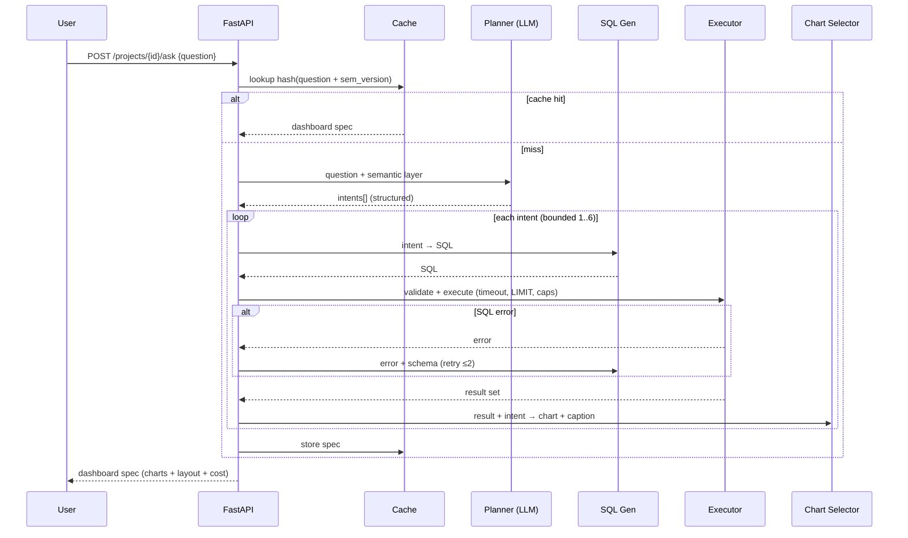

# InsightIQ — Design Document (v0.1, Phase 0)

> Text-to-dashboard platform. A user connects data → gets an auto-generated,
> editable **semantic layer** → asks a plain-English question → receives a
> **multi-chart dashboard**, with a versioned **eval suite** scoring SQL accuracy.

This document is the contract for everything that follows. It reflects a set of
**default decisions** (marked ⚙️) that some of them depend on your answers to the
Phase 0 clarifying questions; where an answer would change the design, it says so.

---

## 1. Architecture

```mermaid
flowchart TD
    subgraph Client["Frontend — React + Vite + TS"]
        UI["Upload / Connect · Semantic-layer editor · Ask box · Dashboard grid · Eval page"]
    end

    subgraph API["Backend — FastAPI (routers → services → repositories)"]
        R["v1 routers"]
        ING["Ingestion service<br/>(CSV/XLSX → DuckDB, PG introspect)"]
        PROF["Profiling service"]
        SEM["Semantic-layer service<br/>(auto-gen + versioning)"]
        PLAN["Planner<br/>(question → intents, structured outputs)"]
        GEN["SQL generator<br/>(intent → dialect SQL)"]
        EXE["Sandboxed executor<br/>(sqlglot validate · timeout · LIMIT · caps)"]
        CHART["Chart selector<br/>(rules first, LLM fallback)"]
        ASM["Assembler<br/>(dashboard spec)"]
        EVAL["Eval harness"]
        LLM["LLM adapter<br/>(Gemini | mock | anthropic)"]
    end

    subgraph Data["Storage"]
        PG[("Postgres<br/>app metadata")]
        DUCK[("DuckDB<br/>per-project analytics")]
        CACHE[("Response cache<br/>hash(question+sem_version)")]
    end

    EXTPG[("Client Postgres<br/>read-only role")]:::ext

    UI -->|HTTP/JSON| R
    R --> ING & PROF & SEM & PLAN & EVAL
    ING --> DUCK
    ING --> EXTPG
    PROF --> DUCK & EXTPG
    SEM --> LLM
    SEM --> PG
    PLAN --> LLM --> GEN --> EXE
    EXE --> DUCK & EXTPG
    EXE --> CHART --> ASM --> R
    PLAN -.cache.-> CACHE
    EVAL --> GEN & EXE & PG
    SEM & PLAN & GEN --> PG

    classDef ext fill:#2b1d1d,stroke:#a55;
```



**Why this shape**

- **Two stores, deliberately separate.** Postgres holds *metadata* (projects,
  semantic layers, eval runs, usage). DuckDB holds *the actual analytical data*,
  one file per project — fast local OLAP, zero server to run, trivially
  disposable. They never mix.
- **The semantic layer is the choke point.** The planner and SQL generator only
  ever see semantic-layer definitions, never raw schema. This is the core
  differentiator and the main injection-surface reduction.
- **Everything LLM goes through one adapter.** Swapping providers = one class +
  a config flag. Planner/semantic outputs use **structured outputs (constrained
  decoding)** so we never regex-parse free text.

---

## 2. Component responsibilities

| Component | Input | Output | Phase |
|-----------|-------|--------|-------|
| Ingestion | CSV/XLSX upload, or PG connection string | tables in DuckDB / introspected PG schema | 1 |
| Profiling | a table | per-column stats (type, null %, distinct, min/max, samples) | 1 |
| Semantic-layer gen | profiles | proposed entities/measures/dimensions/joins/synonyms (YAML) | 2 |
| Planner | question + semantic layer | 1–6 typed **analysis intents** (JSON) | 3 |
| SQL generator | one intent + semantic layer | dialect SQL (DuckDB/PG) | 3 |
| Executor | SQL | validated result set (rows/cols) or safe error | 3 |
| Chart selector | one result set + intent | chart type + encoding + insight caption | 4 |
| Assembler | all charts | dashboard spec (grid layout) | 4 |
| Eval harness | test set + pipeline | scores (exec accuracy, valid-SQL, intent, latency, cost) | 5 |

---

## 3. Request lifecycle — "ask" (Phase 3–4 target)



Self-correction is bounded (**≤2 retries per intent**); on final failure the
intent degrades to a "couldn't answer this part" card rather than failing the
whole dashboard.

---

## 4. Data models (Postgres — app metadata)

Illustrative DDL (SQLAlchemy models + Alembic migrations land in Phase 1).

```sql
project(
  id            uuid pk,
  name          text not null,
  slug          text unique not null,
  data_source   text not null,           -- 'duckdb' | 'postgres' | 'sample'
  created_at    timestamptz default now()
);

data_source(
  id                uuid pk,
  project_id        uuid fk -> project,
  kind              text not null,        -- 'duckdb' | 'postgres'
  config_encrypted  bytea,                -- Fernet-encrypted PG creds; NULL for duckdb
  created_at        timestamptz default now()
);

semantic_layer(
  id          uuid pk,
  project_id  uuid fk -> project,
  version     int not null,               -- monotonically increasing per project
  spec        jsonb not null,             -- canonical semantic-layer document
  is_active   boolean default true,
  created_by  text,                       -- 'system' | 'user'
  created_at  timestamptz default now(),
  unique(project_id, version)
);

ask_request(
  id              uuid pk,
  project_id      uuid fk -> project,
  question        text not null,
  sem_version     int not null,
  plan            jsonb,                   -- the intents[]
  cache_hit       boolean default false,
  latency_ms      int,
  cost_usd        numeric(10,6),
  created_at      timestamptz default now()
);

dashboard(
  id              uuid pk,
  ask_request_id  uuid fk -> ask_request,
  layout          jsonb not null,         -- react-grid-layout positions
  charts          jsonb not null          -- chart specs + data refs
);

eval_run(
  id              uuid pk,
  suite_version   text not null,
  git_sha         text,
  exec_accuracy   numeric(5,4),
  valid_sql_rate  numeric(5,4),
  intent_accuracy numeric(5,4),
  avg_latency_ms  int,
  total_cost_usd  numeric(10,6),
  started_at      timestamptz,
  finished_at     timestamptz
);

eval_case_result(
  id            uuid pk,
  run_id        uuid fk -> eval_run,
  case_id       text not null,
  passed        boolean,
  generated_sql text,
  error         text,
  latency_ms    int,
  cost_usd      numeric(10,6)
);

llm_usage(
  id            uuid pk,
  request_id    text,                      -- correlates with x-request-id
  purpose       text,                      -- 'plan' | 'sql' | 'caption' | 'semantic'
  model         text,
  input_tokens  int,
  output_tokens int,
  cost_usd      numeric(10,6),
  created_at    timestamptz default now()
);
```

`query_cache` is a table in Phase 3 (`key_hash`, `project_id`, `response`,
`created_at`) and can move to Redis in Phase 6 if we need TTL/eviction.

---

## 5. Semantic-layer schema

Custom, dbt/LookML-*inspired* but intentionally simple and human-editable.
Stored as `jsonb` in Postgres; presented/edited as YAML in the UI. ⚙️ *(Q5:
confirm YAML-in-UI + this shape, or you want stricter dbt-metrics parity.)*

```yaml
version: 3
project_id: "9f13…"
data_source:
  type: duckdb            # duckdb | postgres
  dialect: duckdb         # drives SQL generation dialect

entities:
  - name: orders
    table: raw_orders                 # physical table/view
    description: "One row per order line item."
    primary_key: [order_id]
    dimensions:
      - name: order_date
        type: time                    # time | categorical | boolean | numeric
        grain: day                    # day | week | month | quarter | year
        sql: order_date
        description: "Date the order was placed."
        synonyms: ["date", "when", "day"]
      - name: region
        type: categorical
        sql: region
        synonyms: ["market", "area"]
    measures:
      - name: revenue
        agg: sum                      # sum | avg | count | count_distinct | min | max
        sql: amount
        format: currency              # currency | number | percent
        description: "Total order amount."
        synonyms: ["sales", "gmv", "turnover"]
      - name: order_count
        agg: count_distinct
        sql: order_id
    joins:
      - to: customers
        type: many_to_one             # many_to_one | one_to_many | one_to_one
        on: "orders.customer_id = customers.customer_id"

metrics:                              # optional named/derived metrics
  - name: aov
    description: "Average order value."
    expr: "revenue / order_count"
    format: currency
```

**Rules the generator enforces**

- SQL is built *only* from `sql:` expressions + declared joins — no free-form
  table access.
- Synonyms feed the planner's mapping from natural language → measures/dims.
- Every version is immutable; edits create `version+1`. The eval suite pins a
  semantic version so scores are reproducible.

---

## 6. API contract (v1)

Base prefix: `/api/v1`. Uniform error envelope: `{"error": {"code","message"}}`.
Every response carries an `x-request-id` header.

| Method | Path | Body / Query | Returns | Phase |
|--------|------|--------------|---------|-------|
| GET | `/health` | — | `{status}` | 0 ✅ |
| GET | `/system/info` | — | app/env/model info | 0 ✅ |
| POST | `/projects` | `{name, source: sample\|duckdb\|postgres}` | `Project` | 1 |
| GET | `/projects` | — | `Project[]` | 1 |
| GET | `/projects/{id}` | — | `Project` | 1 |
| DELETE | `/projects/{id}` | — | `204` | 1 |
| POST | `/projects/{id}/uploads` | multipart file | `{tables[]}` | 1 |
| POST | `/projects/{id}/connections` | `{connection_string}` | `{tables[]}` | 1 |
| GET | `/projects/{id}/tables` | — | `TableMeta[]` | 1 |
| GET | `/projects/{id}/tables/{t}/profile` | — | `ColumnProfile[]` | 1 |
| POST | `/projects/{id}/semantic-layer/generate` | — | `SemanticLayer` (draft) | 2 |
| GET | `/projects/{id}/semantic-layer` | `?version=` | `SemanticLayer` | 2 |
| GET | `/projects/{id}/semantic-layer/versions` | — | `VersionMeta[]` | 2 |
| PUT | `/projects/{id}/semantic-layer` | `SemanticLayer` | new version | 2 |
| POST | `/projects/{id}/ask` | `{question, filters?}` | `Dashboard` | 3–4 |
| GET | `/eval/runs` | — | `EvalRun[]` | 5 |
| POST | `/eval/runs` | `{suite_version?}` | `EvalRun` | 5 |
| GET | `/eval/runs/{id}` | — | `EvalRun + results` | 5 |
| GET | `/admin/usage` | `?from=&to=` | cost/token totals | 6 |

**Selected response shapes** (Pydantic in the code):

```jsonc
// POST /projects/{id}/ask  →  Dashboard
{
  "ask_request_id": "…",
  "question": "monthly revenue by region, this year vs last",
  "cost_usd": 0.0123,
  "cache_hit": false,
  "charts": [
    {
      "id": "c1",
      "title": "Monthly revenue by region",
      "type": "line",                       // line|bar|kpi|scatter|donut|table
      "insight": "North grew 22% YoY, led by Q3.",
      "encoding": { "x": "month", "y": "revenue", "series": "region" },
      "data": { "columns": ["month","region","revenue"], "rows": [/*…*/] },
      "sql": "SELECT …",                     // shown in a 'view SQL' drawer
      "layout": { "x": 0, "y": 0, "w": 8, "h": 6 }
    }
    // …up to 6
  ]
}
```

---

## 7. Safety model (defense in depth)

| Layer | Control |
|-------|---------|
| Parse | `sqlglot` parse; reject non-`SELECT`, multiple statements, DDL/DML |
| Allowlist | only tables/columns present in the pinned semantic layer |
| Denylist | block `COPY`, `ATTACH`, `INSTALL`, `LOAD`, `PRAGMA`, `INTO`, etc. (belt + braces) |
| Limits | statement timeout, auto-`LIMIT` injection, row + byte caps |
| Postgres | dedicated read-only role, `SET statement_timeout`, no superuser |
| Prompt-injection | data *values* are never placed into the instruction channel; the LLM sees schema/semantic definitions, not row contents, when planning |
| Secrets | client DB creds Fernet-encrypted at rest, never logged; key from env |
| Access | single shared secret (`x-app-secret`) gates write/LLM actions; open for public sample-data browsing; isolation lives at `project_id`, so real auth is a middleware swap, not a migration |
| Rate/quota | token-bucket request queue + exponential backoff on 429; graceful degradation ("high demand — try a cached example") instead of erroring in front of a client |
| Cost | response cache keyed on `hash(question + sem_version)` so repeated demo traffic never re-hits quota; usage tracked per request |
| **Privacy** | **free-tier Gemini may use inputs to improve Google's models → the hosted demo runs on synthetic sample data only.** Because the planner sees only semantic-layer definitions + the question — never row contents — the only thing leaving the app is metric/dimension names + the question, never data rows. A documented **bring-your-own paid key** path (Gemini paid or Anthropic) is required for real client data. |

---

## 8. Key tradeoffs (decided for Phase 0)

1. **LLM planning vs. deterministic templates.** → **LLM planner with structured
   outputs**, deterministic chart selection. Planning is the differentiator and
   benefits from language understanding; chart choice is a solved rules problem,
   kept cheap/predictable with an LLM *fallback* only for ambiguity. Gemini's
   native structured output (`responseMimeType: application/json` + `responseSchema`)
   keeps planner output schema-valid by construction (decision D5).
   **Free-tier consequence:** because quota is limited (~10–15 RPM, ~1.5k req/day
   on Flash — verify live in AI Studio), three things are **Phase 3 requirements,
   not nice-to-haves**: a token-bucket queue + backoff on 429, the response cache,
   and graceful 429 degradation.
2. **DuckDB persistence — object storage over a pinned volume (Q3 answered).**
   Per-project DuckDB file behind a **`StorageBackend`** interface with `Local`
   (dev) and `R2` (deploy) impls: load-on-demand + local cache. More host-portable
   and $0 (Cloudflare R2 free tier: 10 GB, no egress) than pinning a volume, and
   survives Render's ephemeral disk / cold starts.
3. **Semantic layer format.** → **Custom simple schema** (§5), not full dbt/LookML.
   Loader is structured so a **dbt importer can slot in later** without touching
   the runtime.
4. **Provider = Gemini free tier ($0), behind a thin adapter.** App never imports
   a vendor SDK. `mock` provider keeps tests/CI free and quota-safe; `anthropic`
   remains a second concrete impl to prove the abstraction + serve the paid path.

---

## 9. Model plan — Gemini free tier ($0)

| Purpose | Model | Why |
|---------|-------|-----|
| Planner + SQL generation | **Gemini 3 Flash** | strong reasoning; native structured output; free tier |
| Insight captions, chart tie-breaks | **Gemini 3.1 Flash-Lite** | higher RPM, ideal for high-volume low-stakes calls |
| Self-correction | same Flash model, error fed back (≤2 retries) | no separate escalation tier |
| Tests / CI | **mock provider** | never costs money or burns quota |

Model ids are env-overridable (`gemini-3.5-flash` is the newer, stronger Flash
if quota allows). The eval suite runs on the single default model; CI runs on
mock. Free-tier RPM/RPD limits change without notice — **verify live in Google
AI Studio.** Free tier = $0, so the admin cost view reads $0 until someone
supplies a paid key.

---

## 10. Deployment (all-free stack)

| Piece | Host | Note |
|-------|------|------|
| Frontend | **Vercel** free | static SPA |
| Backend | **Render** free | sleeps after ~15 min → cold start on first request (Fly.io if that bites) |
| Metadata Postgres | **Neon** free | serverless, data doesn't sleep |
| DuckDB files | **Cloudflare R2** free | 10 GB, no egress; via the `StorageBackend` R2 impl |

Develop against `STORAGE_BACKEND=local` + local Postgres; flip env for deploy.

---

## 11. Open questions

None — Q1–Q5 answered (see PROJECT_STATUS.md "Key decisions"). Frontend visual
direction captured in `docs/UI_DIRECTION.md` for Phase 4.
